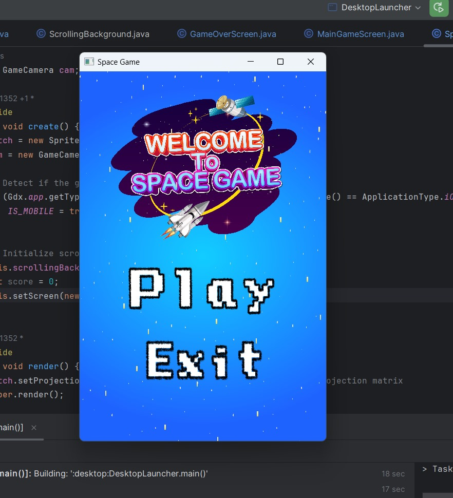
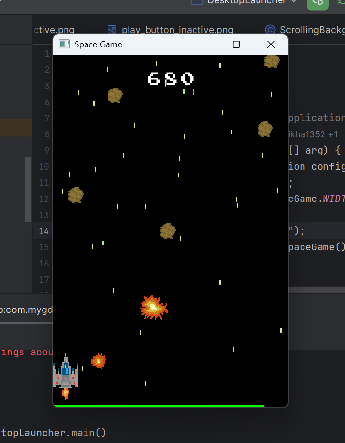
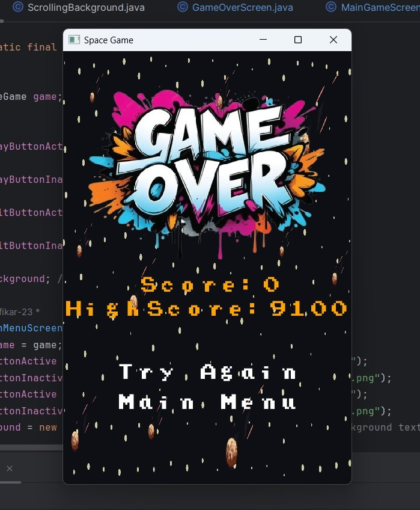

# Space Shooter Game

A simple 2D space shooter game built with **Java** and the **LibGDX** framework. The player controls a spaceship, shoots down incoming asteroids, and tries to score as high as possible.

## 🎮 Gameplay

spaceship stays near the bottom of the screen and can move left/right.
- Asteroids continuously spawn from the top and move downward.
- Shoot bullets from the ship to destroy asteroids and earn points.
- Colliding with an asteroid reduces the ship's **health**; when health reaches zero, the **Game Over** screen is shown.

## 🕹️ Controls

| Key / Action                        | Action                          |
|--------------------------------------|----------------------------------|
| `←` (Left Arrow)                     | Move ship left                  |
| `→` (Right Arrow)                    | Move ship right                 |
| Touch / Tap (left/right of screen)   | Move ship on mobile/touch input |
| Auto-fire                            | Ship fires bullets automatically |

## 🛠️ Tech Stack

- **Java**
- **LibGDX** (game development framework)
- **Gradle** (build tool)

## 📁 Project Structure

```
SpaceShooter-GameProject/
├── core/                   # Core game logic (shared across platforms)
│   └── src/com/mygdx/game/
│       ├── entities/       # Bullet, Asteroid, Explosion, etc.
│       ├── screens/        # MainMenuScreen, MainGameScreen, GameOverScreen
│       └── tools/          # Helper classes like CollisionRect, GameCamera
├── desktop/                # Desktop (LWJGL3) launcher
│   └── src/com/mygdx/game/DesktopLauncher.java
├── assets/                 # Images, fonts, and other game assets
├── build.gradle             # Root Gradle configuration
├── settings.gradle
└── gradlew / gradlew.bat    # Gradle wrapper scripts
```

## 🚀 How to Run

### Prerequisites
- **JDK 8** or higher installed
- Internet connection (for downloading Gradle dependencies on first run)

### Steps

1. Clone or download the repository:
   ```bash
   git clone https://github.com/shikha1352/SpaceShooter-GameProject.git
   cd SpaceShooter-GameProject
   ```

2. Run the desktop version:

   **Linux / macOS:**
   ```bash
   ./gradlew desktop:run
   ```

   **Windows:**
   ```bash
   gradlew.bat desktop:run
   ```

   The Gradle wrapper will automatically download the required dependencies and build & run the game.

## 📦 Building

To build a runnable JAR:
```bash
./gradlew desktop:dist
```
The built JAR file will be located in `desktop/build/libs/`.

## 🔄 Game Flow

```
MainMenuScreen  ──▶  MainGameScreen  ──▶  GameOverScreen
   (Play/Exit)        (Shoot / Score)      (Try Again / Main Menu)
        ▲                                        │
        └────────────────────────────────────────┘
```

### 1. Main Menu (`MainMenuScreen`)
The game opens on a welcome screen with the game logo/artwork and two options:
- **Play** – starts a new game and loads `MainGameScreen`
- **Exit** – closes the game



### 2. Gameplay (`MainGameScreen`)
The core gameplay loop — move the ship, shoot bullets, destroy asteroids, and rack up score while avoiding collisions. When health hits zero, the game transitions to `GameOverScreen`.


*(Illustrative mockup composed from the project's own assets — replace with a real in-game screenshot when available.)*

### 3. Game Over (`GameOverScreen`)
Shows the run's final **Score** and the **High Score**, along with two options:
- **Try Again** – restarts the game (`MainGameScreen`)
- **Main Menu** – returns to `MainMenuScreen`



## 📄 License

No license is currently specified for this project.This project was developed as an academic project for educational purposes.